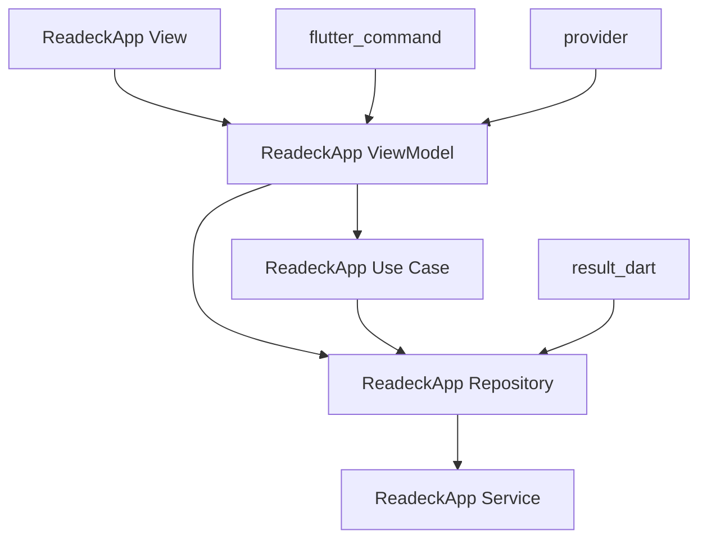

此基于 Material Design 3 设计。需要遵循其最佳实践: flutter 官方文档。

这个 APP 可以连接 Readeck 的数据，作为其手机端程序。

完成代码变动后，你应当始终执行 `flutter analyze` 命令，进行代码检查和错误修复。

所有样式都应使用主题，不允许存在硬编码颜色、字号等。

# ReadeckApp Flutter 工程架构规范文档

基于 Flutter 官方推荐的架构模式和最佳实践

## 目录

1. [项目概述](#项目概述)
2. [核心架构原则](#核心架构原则)
3. [分层架构设计](#分层架构设计)
4. [MVVM 架构模式](#mvvm架构模式)
5. [UI 层实现规范](#ui层实现规范)
6. [数据层实现规范](#数据层实现规范)
7. [依赖注入规范](#依赖注入规范)
8. [项目结构组织](#项目结构组织)
9. [核心库使用规范](#核心库使用规范)
10. [编码最佳实践](#编码最佳实践)
11. [测试策略](#测试策略)

---

## 项目概述

**ReadeckApp** 是一个基于 Flutter 官方推荐架构模式构建的应用项目。本文档定义了项目的编码规范，确保代码的一致性、可维护性和可测试性。

### 架构技术栈

- **架构模式**：MVVM + Repository Pattern
- **状态管理**：ChangeNotifier + ListenableBuilder
- **命令模式**：flutter_command
- **结果处理**：result_dart
- **依赖注入**：provider
- **路由管理**：go_router
- **数据模型**：freezed

---

## 核心架构原则

### 1. 关注点分离（Separation of Concerns）

将 ReadeckApp 功能划分为不同的、自包含的单元：

- **UI 逻辑与业务逻辑严格分离**
- **数据获取与数据展示分离**
- **按功能模块进行组织**
- **每个类只负责单一职责**

### 2. 单一数据源（Single Source of Truth）

ReadeckApp 中每种数据类型都有唯一的数据源：

- Repository 作为特定数据类型的 SSOT
- 避免数据重复和不一致
- 统一的数据管理策略

### 3. 单向数据流（Unidirectional Data Flow）

ReadeckApp 采用严格的单向数据流：

```
[数据层] → [逻辑层] → [UI层]
    ↑                    ↓
    ←── [Command执行] ←───
```

### 4. 声明式 UI

ReadeckApp 界面基于状态驱动：

```
UI = f(State)
```

---

## 分层架构设计

### ReadeckApp 三层架构

```
┌─────────────────────────────────────┐
│               UI层                   │
│     (Views & ViewModels)             │
│  - 页面展示和用户交互                 │
│  - 使用flutter_command处理命令        │
├─────────────────────────────────────┤
│              逻辑层                   │
│           (Use Cases)                │
│  - 复杂业务逻辑封装 (可选)             │
│  - 多Repository协调                  │
├─────────────────────────────────────┤
│              数据层                   │
│    (Repositories & Services)         │
│  - 数据管理和API调用                  │
│  - 使用result_dart处理结果            │
└─────────────────────────────────────┘
```

### 各层职责定义

| 层次       | 组件                | ReadeckApp 中的职责                              |
| ---------- | ------------------- | ------------------------------------------------ |
| **UI 层**  | View, ViewModel     | 展示 ReadeckApp 界面、处理用户交互、管理页面状态 |
| **逻辑层** | Use Cases           | 封装 ReadeckApp 复杂业务逻辑、协调多个数据源     |
| **数据层** | Repository, Service | 管理 ReadeckApp 数据、API 调用、本地存储         |

---

## MVVM 架构模式

### ReadeckApp MVVM 实现



### 关系规则

- **每个功能页面对应一个 View 和一个 ViewModel**
- **ViewModel 持有 Repository 的引用**
- **Repository 可被多个 ViewModel 共享**
- **Service 专注于单一数据源**

---

## UI 层实现规范

### View 实现规范

**ReadeckApp View 规范要点：**

1. **构造函数只接受 key 和 viewModel**
2. **处理 Command 的不同状态（执行中、错误、完成）**
3. **不包含任何业务逻辑**
4. **用户交互通过 Command 执行**

### ViewModel 实现规范

**ReadeckApp ViewModel 规范要点：**

1. **继承 ChangeNotifier**
2. **Repository 作为私有 final 成员**
3. **使用 flutter_command 的 Command 类**
4. **UI 状态使用 private setter + public getter**
5. **在构造函数中初始化 Commands**
6. **给 View 暴露的异步方法使用 Command 进行暴露**

---

## 数据层实现规范

### Repository 实现规范

**ReadeckApp Repository 规范要点：**

1. **返回 Result<T>类型**
2. **包含缓存逻辑**
3. **错误处理和重试逻辑**
4. **API 模型转换为领域模型**
5. **私有 Service 引用**

### Service 实现规范

**ReadeckApp Service 规范要点：**

1. **无状态类**
2. **返回 Result<T>类型**
3. **统一的错误处理**
4. **专注于单一数据源**
5. **私有 Dio/SharedPreferences 引用**

---

## 依赖注入规范

// TODO

---

## 项目结构组织

### ReadeckApp 目录结构

```
lib/
├── main.dart                        # ReadeckApp入口
├── main_viewmodel.dart              # 主应用ViewModel
│
├── config/                          # ReadeckApp配置
│   └── dependencies.dart            # 依赖注入配置
│
├── ui/                             # ReadeckApp UI层
│   ├── core/                       # 核心UI组件
│   │   ├── main_layout.dart        # 主布局
│   │   ├── theme.dart              # 主题配置
│   │   └── ui/                     # 通用UI组件
│   │
│   ├── api_config/                 # API配置功能
│   │   ├── view_models/            # API配置ViewModels
│   │   └── widgets/                # API配置Widgets
│   │
│   ├── bookmarks/                  # 书签功能
│   │   ├── view_models/            # 书签ViewModels
│   │   └── widget/                 # 书签Widgets
│   │
│   ├── daily_read/                 # 每日阅读功能
│   │   ├── view_models/            # 每日阅读ViewModels
│   │   └── widgets/                # 每日阅读Widgets
│   │
│   └── settings/                   # 设置功能
│       ├── view_models/            # 设置ViewModels
│       └── widgets/                # 设置Widgets
│
├── domain/                         # ReadeckApp领域层
│   ├── models/                     # 领域模型
│   │   ├── bookmark/               # 书签相关模型
│   │   └── daily_read_history/     # 每日阅读历史模型
│   │
│   └── use_cases/                  # 业务用例
│       └── bookmark_operation_use_cases.dart
│
├── data/                           # ReadeckApp数据层
│   ├── repository/                 # Repository实现
│   │   ├── bookmark/               # 书签Repository
│   │   ├── daily_read_history/     # 每日阅读历史Repository
│   │   ├── settings/               # 设置Repository
│   │   └── theme/                  # 主题Repository
│   │
│   └── service/                    # Service实现
│       ├── database_service.dart   # 数据库服务
│       ├── readeck_api_client.dart # Readeck API客户端
│       └── shared_preference_service.dart # 本地存储服务
│
├── routing/                        # ReadeckApp路由
│   ├── router.dart                 # 路由配置
│   └── routes.dart                 # 路由定义
│
└── utils/                          # ReadeckApp工具类
    ├── api_not_configured_exception.dart # API未配置异常
    └── option_data.dart            # 选项数据工具

test/                              # ReadeckApp测试
├── unit/                          # 单元测试
│   ├── data/                      # 数据层测试
│   ├── domain/                    # 领域层测试
│   └── ui/                        # UI层测试
├── widget/                        # Widget测试
├── integration/                   # 集成测试
└── helpers/                       # 测试辅助

test_resources/                    # 测试资源
├── mocks/                         # Mock对象
└── fixtures/                      # 测试数据
```

### ReadeckApp 命名规范

| 类型           | 命名规范                        | 示例                          |
| -------------- | ------------------------------- | ----------------------------- |
| **ViewModel**  | `{Feature}ViewModel`            | `ReadingListViewModel`        |
| **Screen**     | `{Feature}Screen`               | `ReadingListScreen`           |
| **Repository** | `{Domain}Repository`            | `ArticleRepository`           |
| **Service**    | `{Purpose}Service`              | `ReadeckApiService`           |
| **Model**      | `{Entity}` / `{Entity}ApiModel` | `Article` / `ArticleApiModel` |
| **UseCase**    | `{Action}UseCase`               | `SyncArticlesUseCase`         |
| **Exception**  | `{Context}Exception`            | `ReadeckException`            |

---

## 编码最佳实践

### ReadeckApp 强制要求

| 规范             | 说明                                 | 示例                                         |
| ---------------- | ------------------------------------ | -------------------------------------------- |
| **分层架构**     | 严格按照 UI/逻辑/数据层组织代码      | Repository 不能直接被 View 使用              |
| **MVVM 模式**    | 每个页面都有对应的 View 和 ViewModel | `ReadingListScreen` + `ReadingListViewModel` |
| **Command 模式** | 所有用户交互都通过 Command 执行      | `loadArticlesCommand.execute()`              |
| **Result 模式**  | 所有可能失败的操作都返回 Result      | `Future<Result<List<Article>>>`              |
| **依赖注入**     | 使用 Provider 进行依赖管理           | 构造函数注入 Repository                      |
| **不可变模型**   | 所有数据模型都使用 freezed           | `@freezed class Article`                     |

### ReadeckApp 推荐实践

| 规范              | 说明                      | 适用场景                 |
| ----------------- | ------------------------- | ------------------------ |
| **使用 Use Case** | 封装复杂业务逻辑          | 跨多个 Repository 的操作 |
| **缓存策略**      | Repository 层实现数据缓存 | 频繁访问的数据           |
| **离线支持**      | 本地存储作为数据备份      | 重要的用户数据           |
| **错误处理**      | 统一的错误处理机制        | 网络请求和数据操作       |

### ReadeckApp 代码示例

---

## 测试策略

### ReadeckApp 测试规范

### ReadeckApp 测试要求

1. **Repository 层 100%测试覆盖**
2. **ViewModel 层 100%测试覆盖**
3. **关键 Widget 的 UI 测试**
4. **Command 执行流程测试**
5. **Result 处理逻辑测试**

---

## 总结

ReadeckApp 项目严格遵循 Flutter 官方推荐的架构模式，结合以下核心技术栈：

### 核心架构

- **MVVM + Repository Pattern**
- **单向数据流**
- **依赖注入**

### 核心库

- **flutter_command**: Command 模式实现
- **result_dart**: 结果处理
- **provider**: 依赖注入
- **freezed**: 不可变模型

### 质量保证

- **完整的测试覆盖**
- **统一的错误处理**
- **清晰的代码结构**

通过遵循本规范，ReadeckApp 项目将具备良好的可维护性、可测试性和可扩展性，为后续开发和维护提供坚实的基础。
