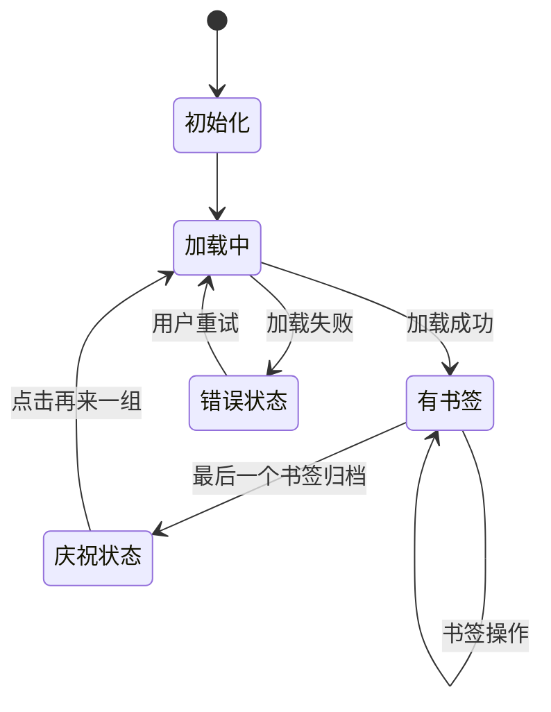

# 每日阅读功能规格说明

## 📋 功能概述

### 核心定位
每日阅读功能是ReadeckApp的核心特性，旨在为用户提供**个性化的每日书签推荐体验**，通过算法化推荐和游戏化激励机制，帮助用户养成持续阅读的习惯。

### 设计理念
- **习惯养成**: 每日推荐固定数量书签，培养用户定期阅读习惯
- **游戏化体验**: 完成阅读任务后的庆祝动画，增强成就感
- **个性化推荐**: 基于用户的书签库智能推荐未读内容
- **简化决策**: 减少选择困难，专注阅读体验

---

## 🎯 业务需求分析

### 用户痛点
1. **选择困难**: 书签太多不知道从哪里开始阅读
2. **缺乏动力**: 没有阅读进度反馈和成就感
3. **习惯缺失**: 没有固定的阅读节奏和提醒
4. **内容分散**: 书签管理和阅读体验割裂

### 解决方案
1. **智能推荐**: 每日随机推荐5个未归档书签
2. **进度可视化**: 实时显示阅读进度和完成状态
3. **即时反馈**: 完成任务后的庆祝动画和激励文案
4. **历史保持**: 保存每日推荐历史，支持继续未完成的阅读

---

## 🏗️ 系统架构

### 技术架构
```
┌─────────────────────────────────────┐
│            UI层 (View)               │
│  - DailyReadScreen                  │
│  - BookmarkCard                     │  
│  - CelebrationOverlay               │
├─────────────────────────────────────┤
│         逻辑层 (ViewModel)           │
│  - DailyReadViewModel               │
│  - Command模式处理用户操作            │
├─────────────────────────────────────┤
│         数据层 (Repository)         │
│  - BookmarkRepository              │
│  - DailyReadHistoryRepository      │
│  - LabelRepository                 │
├─────────────────────────────────────┤
│        服务层 (Service)              │
│  - ReadeckApiService               │
│  - DatabaseService                 │
│  - SharedPreferenceService         │
└─────────────────────────────────────┘
```

### 数据模型
```dart
// 核心数据模型
class DailyReadHistory {
  int id;
  DateTime createdDate;
  List<String> bookmarkIds;
}

class BookmarkDisplayModel {
  Bookmark bookmark;
  ReadingStatsForView? stats;
}

class Bookmark {
  String id;
  String url;
  String title;
  bool isArchived;
  bool isMarked;
  List<String> labels;
  DateTime created;
  int readProgress;
}
```

---

## 🔄 核心业务逻辑

### 1. 数据加载逻辑
```
启动页面
    ↓
检查今日历史记录
    ↓
┌─────────────────┬─────────────────┐
│   存在历史记录   │   不存在历史记录   │
│       ↓         │       ↓         │
│  加载历史书签    │  生成随机推荐    │
│       ↓         │       ↓         │
│   显示列表      │   保存到历史     │
│               │       ↓         │
│               │   显示列表      │
└─────────────────┴─────────────────┘
```

**代码实现**: `DailyReadViewModel._load()` (`daily_read_viewmodel.dart:78-130`)

### 2. 状态判断逻辑
```
渲染页面
    ↓
unArchivedBookmarks.isEmpty?
    ↓
┌─────────────────┬─────────────────┐
│      是         │       否        │
│       ↓         │       ↓         │
│   显示庆祝页面   │   isNoMore?     │
│   (礼花+动画)   │       ↓         │
│               │ ┌─────┬─────┐    │
│               │ │  是  │  否  │   │
│               │ │  ↓  │  ↓  │   │
│               │ │无更多│书签│   │
│               │ │页面 │列表│   │
└─────────────────┴─────┴─────┘
```

**代码实现**: `DailyReadScreen.render()` (`daily_read_screen.dart:106-223`)

### 3. 书签操作逻辑
```
用户操作
    ↓
┌─────────┬─────────┬─────────┬─────────┐
│  归档   │  标记   │ 打开URL │ 更新标签 │
│   ↓     │   ↓     │   ↓     │   ↓     │
│Repository│Repository│UseCase │Repository│
│   ↓     │   ↓     │   ↓     │   ↓     │
│API调用  │API调用  │系统浏览器│API调用  │
│   ↓     │   ↓     │   ↓     │   ↓     │
│监听器触发│监听器触发│   -    │监听器触发│
│   ↓     │   ↓     │        │   ↓     │
│UI刷新   │UI刷新   │        │UI刷新   │
└─────────┴─────────┘        └─────────┘
```

---

## 🎮 用户交互流程

### 主要用户路径

#### 路径1: 首次访问
```
1. 用户打开每日阅读页面
2. 系统显示Loading状态 ("正在加载今日推荐")
3. 系统获取5个随机未归档书签
4. 系统保存今日推荐历史
5. 显示书签卡片列表
```

#### 路径2: 重复访问
```
1. 用户打开每日阅读页面
2. 系统显示Loading状态
3. 系统从历史记录加载今日书签
4. 显示书签卡片列表 (保持之前的阅读状态)
```

#### 路径3: 完成阅读任务
```
1. 用户逐个归档书签
2. 当最后一个书签被归档时
3. 触发归档回调 -> 播放礼花动画
4. 显示庆祝页面 ("🎉 恭喜完成今日阅读！")
5. 用户可点击"再来一组"刷新新内容
```

#### 路径4: 书签操作
```
用户在书签卡片上可以进行：
├── 点击卡片 → 导航到书签详情页
├── 点击标记按钮 → 切换书签标记状态
├── 点击归档按钮 → 归档书签
├── 点击标签 → 编辑书签标签
└── 点击URL → 在系统浏览器中打开
```

### 交互细节

#### 1. 加载状态
- **触发条件**: Command正在执行且结果为空
- **显示内容**: Loading组件 + "正在加载今日推荐"
- **用户操作**: 无法操作，等待加载完成

#### 2. 书签列表状态
- **触发条件**: 有未归档书签存在
- **显示内容**: ListView + BookmarkCard组件
- **用户操作**: 
  - 滑动浏览书签
  - 点击各种操作按钮
  - 点击卡片查看详情

#### 3. 庆祝状态
- **触发条件**: `unArchivedBookmarks.isEmpty`
- **显示内容**: 
  - ConfettiWidget礼花动画
  - CelebrationOverlay庆祝文案
  - 当前日期显示
  - "再来一组"按钮
- **用户操作**: 点击"再来一组"刷新新内容

#### 4. 错误状态
- **网络错误**: ErrorPage.networkError()
- **未知错误**: ErrorPage.unknownError()
- **用户操作**: 点击重试按钮

---

## 📊 状态管理

### ViewModel状态
```dart
class DailyReadViewModel extends ChangeNotifier {
  // 核心状态
  List<BookmarkDisplayModel> _todayBookmarks = [];
  bool _isNoMore = false;
  
  // 计算属性
  List<BookmarkDisplayModel> get bookmarks;
  List<BookmarkDisplayModel> get unArchivedBookmarks;
  List<String> get availableLabels;
  bool get isNoMore;
  
  // 命令对象
  late Command<bool, List<BookmarkDisplayModel>> load;
  late Command<String, void> openUrl;
  late Command<Bookmark, void> toggleBookmarkArchived;
  late Command<Bookmark, void> toggleBookmarkMarked;
  late Command<void, List<String>> loadLabels;
}
```

### 状态流转图


### 监听器机制
```dart
// Repository数据变化监听
_bookmarkRepository.addListener(_onBookmarksChanged);
_labelRepository.addListener(_onLabelsChanged);

// 归档完成回调
VoidCallback? _onBookmarkArchivedCallback;
```

---

## 🎨 UI组件设计

### 组件层次结构
```
DailyReadScreen (StatefulWidget)
├── ConfettiController (礼花动画控制)
├── Consumer<DailyReadViewModel> (状态监听)
└── CommandBuilder (Command状态处理)
    ├── Loading (加载状态)
    ├── ErrorPage (错误状态)
    └── render() (内容渲染)
        ├── Stack (庆祝状态)
        │   ├── ConfettiWidget
        │   └── CelebrationOverlay
        ├── Center (无更多书签状态)
        └── ListView.builder (书签列表)
            └── BookmarkCard (书签卡片)
```

### 主题和样式
- **使用Material Design 3设计规范**
- **所有颜色使用Theme.of(context).colorScheme**
- **所有文字样式使用Theme.of(context).textTheme**
- **礼花颜色动态适配主题色彩**

### 动画效果
```dart
// 礼花动画配置
ConfettiController(duration: Duration(seconds: 3))
blastDirection: -pi / 4  // 向右上方发射
maxBlastForce: 40
minBlastForce: 5
emissionFrequency: 0.05
numberOfParticles: 50
gravity: 0.1
```

---

## 📈 性能优化

### 数据加载优化
1. **缓存策略**: Repository层实现数据缓存
2. **历史复用**: 同一天多次访问直接加载历史
3. **异步保存**: 今日书签历史异步保存，不阻塞UI
4. **增量更新**: 只刷新变化的书签状态

### UI渲染优化
1. **ListView.builder**: 大列表懒加载
2. **Key优化**: 为BookmarkCard提供稳定key
3. **动画控制**: 礼花动画自动停止，避免内存泄漏
4. **监听器管理**: 及时清理监听器避免内存泄漏

### 内存管理
```dart
@override
void dispose() {
  // 清理动画控制器
  _confettiController.dispose();
  // 清理回调
  widget.viewModel.setOnBookmarkArchivedCallback(null);
  // 清理监听器
  _bookmarkRepository.removeListener(_onBookmarksChanged);
  _labelRepository.removeListener(_onLabelsChanged);
  super.dispose();
}
```

---

## 🔍 错误处理

### 错误类型
1. **网络错误**: NetworkErrorException
2. **资源不存在**: ResourceNotFoundException  
3. **未知错误**: Exception

### 错误处理策略
```dart
// ViewModel层错误处理
if (result.isError()) {
  appLogger.e("操作失败", error: result.exceptionOrNull()!);
  throw result.exceptionOrNull()!;
}

// UI层错误处理
CommandBuilder(
  onError: (context, error, lastValue, param) {
    switch (error) {
      case NetworkErrorException _:
        return ErrorPage.networkError(
          error: error,
          onBack: () => viewModel.load.execute(false),
        );
      default:
        return ErrorPage.unknownError(error: Exception(error));
    }
  },
)
```

### 用户友好提示
- **网络错误**: "网络开小差啦" + 重试按钮
- **操作失败**: SnackBar提示具体错误信息
- **未知错误**: "未知错误" + 联系开发者信息

---

## 📱 用户体验设计

### 视觉反馈
1. **Loading状态**: 清晰的加载指示器
2. **操作反馈**: 按钮点击状态变化
3. **完成庆祝**: 礼花动画 + 激励文案
4. **错误提示**: 统一的错误页面设计

### 交互体验
1. **直观操作**: 图标 + 文字的组合按钮
2. **即时响应**: 操作后立即UI更新
3. **状态保持**: 页面切换后状态保持
4. **容错设计**: 网络异常时的优雅降级

### 文案设计
```
- 加载中: "正在加载今日推荐"
- 庆祝完成: "🎉 恭喜完成今日阅读！"
- 激励文案: "您已经完成了今天的所有阅读任务\n坚持阅读，收获知识！"
- 操作按钮: "再来一组" / "刷新"
- 无更多书签: "已读完所有待读书签\n太棒了！去Readeck添加更多书签继续阅读吧！"
```

---

## 🧪 测试策略

### 测试覆盖
- **ViewModel测试**: 100% 业务逻辑覆盖
- **Widget测试**: 主要UI状态和交互覆盖
- **集成测试**: 完整用户流程验证

### 关键测试用例
1. 首次加载随机书签流程
2. 历史记录加载流程
3. 书签操作(归档/标记/URL打开)
4. 状态切换(Loading/列表/庆祝)
5. 错误处理和恢复
6. 资源清理和内存管理

---

## 🔮 未来扩展

### 潜在功能增强
1. **个性化推荐**: 基于阅读历史的智能推荐算法
2. **阅读统计**: 每日/每周/每月阅读数据分析
3. **社交功能**: 分享阅读成就到社交媒体
4. **离线支持**: 缓存书签内容支持离线阅读
5. **定制化**: 用户自定义每日推荐数量和类型

### 技术架构演进
1. **微服务化**: Repository层抽象为独立服务
2. **状态管理升级**: 考虑引入Bloc或Riverpod
3. **缓存优化**: 实现更智能的数据缓存策略
4. **性能监控**: 添加性能指标收集和分析

---

## 📚 相关文档

- [架构设计规范](/.trae/rules/project_rules.md)
- [测试用例文档](./test_coverage_report.md)
- [API接口文档](./api_specification.md)
- [UI设计规范](./ui_design_guidelines.md)

---

*文档版本: v1.0*  
*最后更新: 2025-08-15*  
*维护者: ReadeckApp开发团队*