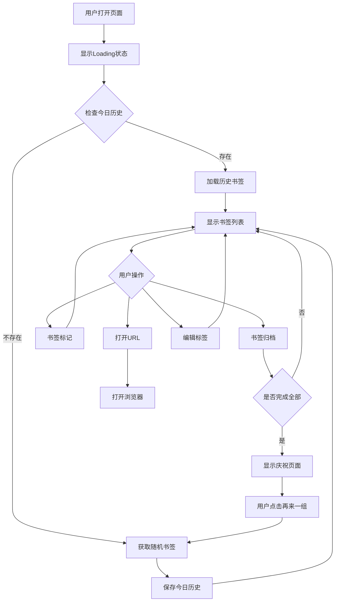
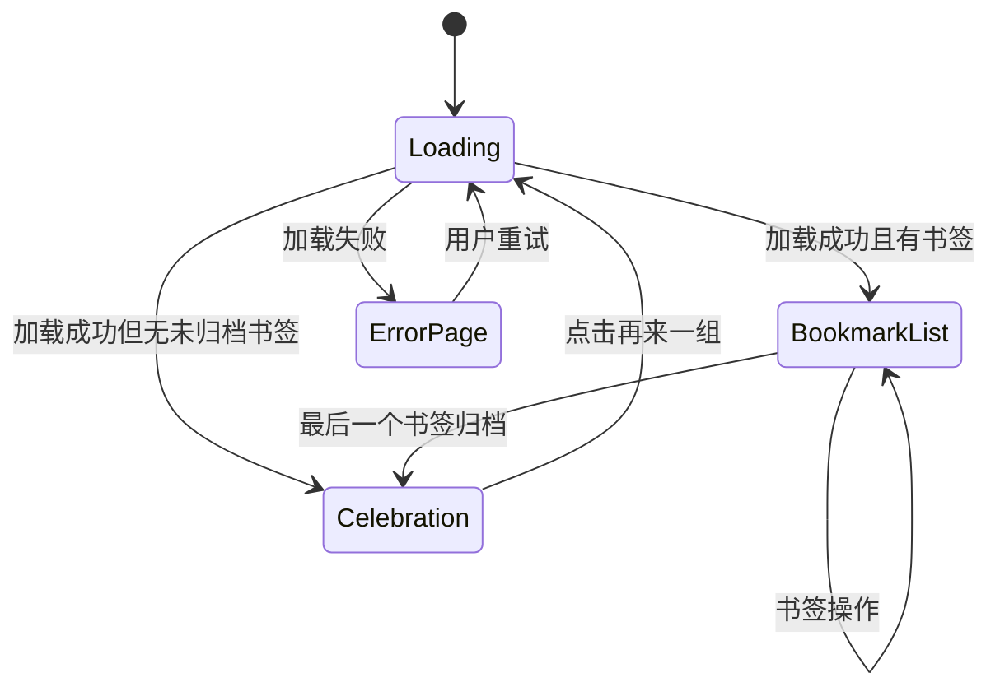
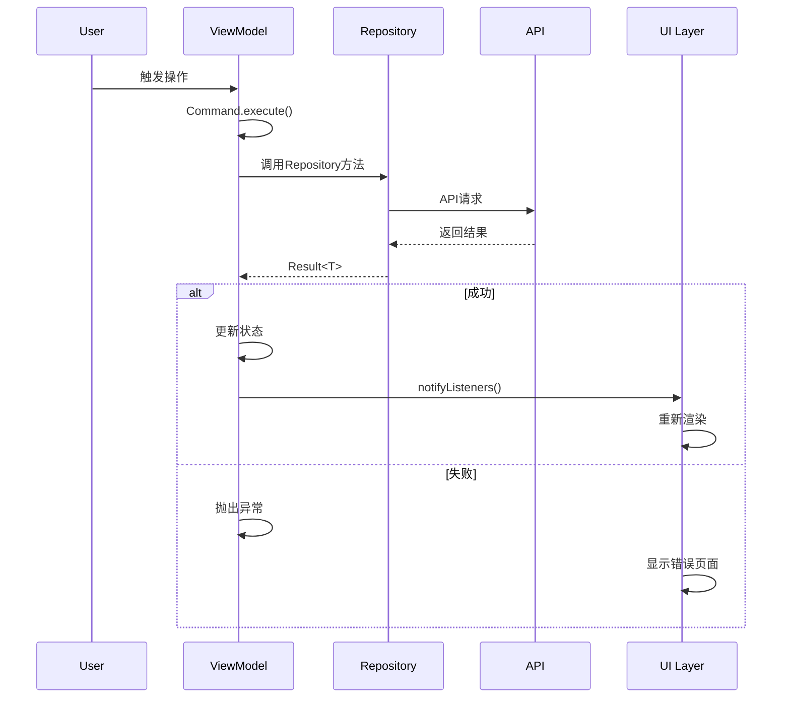
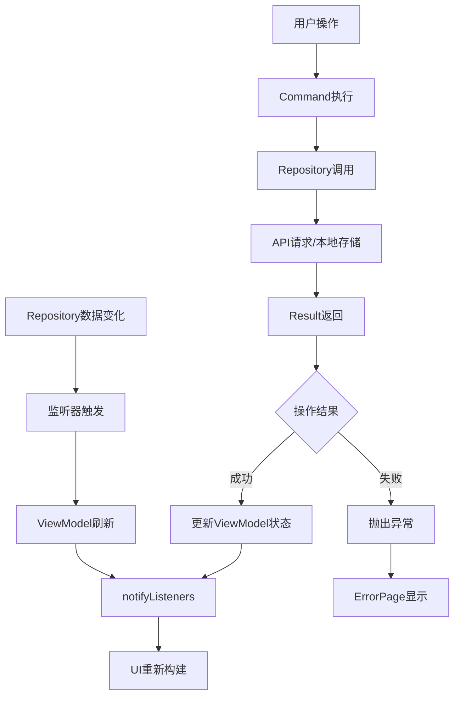
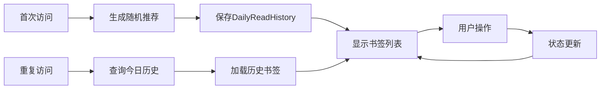

# 每日阅读交互流程图

## 🔄 核心交互流程

### 1. 数据加载流程


### 2. UI状态切换流程


### 3. Command执行流程


## 📱 用户交互路径

### 路径A: 首次使用
```
开始 → Loading → 随机书签列表 → 操作书签 → 完成庆祝 → 再来一组
```

### 路径B: 继续阅读
```
开始 → Loading → 历史书签列表 → 继续操作 → 完成庆祝
```

### 路径C: 错误恢复
```
开始 → Loading → 错误页面 → 重试 → 正常流程
```

## 🎮 操作映射表

| 用户操作 | UI组件 | ViewModel方法 | Repository方法 | 结果反馈 |
|---------|-------|---------------|----------------|----------|
| 打开页面 | DailyReadScreen | load.execute() | loadRandomUnarchivedBookmarks() | 显示书签列表 |
| 归档书签 | BookmarkCard | toggleBookmarkArchived | toggleArchived() | UI刷新+可能触发庆祝 |
| 标记书签 | BookmarkCard | toggleBookmarkMarked | toggleMarked() | UI刷新 |
| 打开URL | BookmarkCard | openUrl | openUrl() | 打开浏览器 |
| 编辑标签 | BookmarkCard | updateBookmarkLabels | updateLabels() | UI刷新 |
| 点击卡片 | BookmarkCard | - | - | 导航到详情页 |
| 再来一组 | CelebrationOverlay | load.execute(true) | loadRandomUnarchivedBookmarks() | 重新加载 |
| 刷新 | ErrorPage | load.execute(false) | loadRandomUnarchivedBookmarks() | 重试加载 |

## 🔧 状态管理详解

### ViewModel状态属性
```dart
// 私有状态
List<BookmarkDisplayModel> _todayBookmarks  // 今日推荐书签
bool _isNoMore                              // 是否没有更多书签

// 计算属性 (getter)
List<BookmarkDisplayModel> bookmarks        // 过滤后的书签列表
List<BookmarkDisplayModel> unArchivedBookmarks  // 未归档书签列表
List<String> availableLabels               // 可用标签列表
bool isNoMore                              // 是否没有更多书签
```

### 命令对象
```dart
Command<bool, List<BookmarkDisplayModel>> load           // 加载书签
Command<String, void> openUrl                           // 打开URL
Command<Bookmark, void> toggleBookmarkArchived          // 切换归档状态
Command<Bookmark, void> toggleBookmarkMarked            // 切换标记状态
Command<void, List<String>> loadLabels                  // 加载标签
```

### 监听器机制
```dart
// Repository数据变化监听
_bookmarkRepository.addListener(_onBookmarksChanged);
_labelRepository.addListener(_onLabelsChanged);

// 书签归档完成回调
VoidCallback? _onBookmarkArchivedCallback;
```

## 🎨 UI渲染逻辑

### render()方法决策树
```
render()
├── unArchivedBookmarks.isEmpty?
│   ├── 是 → Stack(ConfettiWidget + CelebrationOverlay)
│   └── 否 → isNoMore?
│       ├── 是 → Center(无更多书签提示)
│       └── 否 → ListView.builder(书签列表)
```

### CommandBuilder状态处理
```
CommandBuilder
├── whileExecuting → Loading组件 (if lastValue.isEmpty)
├── onError → ErrorPage (NetworkError | UnknownError)
└── onData → render()
```

## 📊 数据流图

### 完整数据流


### 历史记录管理


## 🔄 生命周期管理

### 页面生命周期
```dart
initState() {
  // 初始化礼花控制器
  _confettiController = ConfettiController(duration: Duration(seconds: 3));
  // 设置归档回调
  widget.viewModel.setOnBookmarkArchivedCallback(_onBookmarkArchived);
}

didChangeDependencies() {
  // 设置Command错误监听
  widget.viewModel.load.errors.listen(...);
  widget.viewModel.toggleBookmarkArchived.errors.listen(...);
  widget.viewModel.toggleBookmarkMarked.errors.listen(...);
}

dispose() {
  // 清理动画控制器
  _confettiController.dispose();
  // 清除回调
  widget.viewModel.setOnBookmarkArchivedCallback(null);
  super.dispose();
}
```

### ViewModel生命周期
```dart
构造函数() {
  // 初始化Commands
  load = Command.createAsync<bool, List<BookmarkDisplayModel>>(_load, ...);
  // 注册监听器
  _bookmarkRepository.addListener(_onBookmarksChanged);
  _labelRepository.addListener(_onLabelsChanged);
  // 自动加载
  load.execute(false);
}

dispose() {
  // 移除监听器
  _bookmarkRepository.removeListener(_onBookmarksChanged);
  _labelRepository.removeListener(_onLabelsChanged);
  super.dispose();
}
```

---

*此文档描述了每日阅读功能的完整交互流程和业务逻辑*  
*版本: v1.0 | 更新时间: 2025-08-15*